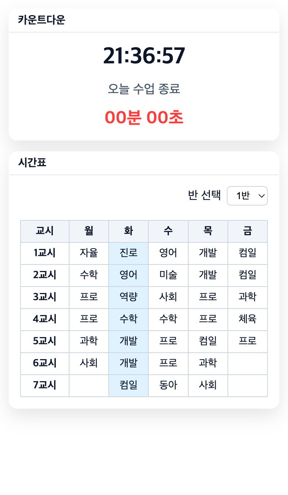

<h1 style="text-align: middle">Schoool</h1>
* 대구소프트웨어마이스터고 학생용 대시보드입니다.
- 급식 확인하기 기능을 사용하려면 [NEIS API](https://open.neis.go.kr/portal/guide/apiIntroPage.do) 키가 필요합니다.

## 사용된 스택

스크린샷

  

* `Backend` Python + Flask (Jinja)
* `Frontend` HTML + CSS + JavaScript
* `Deploy` Gunicorn + Nginx + Cloudflare

> `⚠️` 현재 서비스 중인 웹사이트는 [Netlify](https://www.netlify.com)를 사용하여 정적 웹으로 운영되고 있으므로 **급식 확인하기 기능이 없습니다.**
